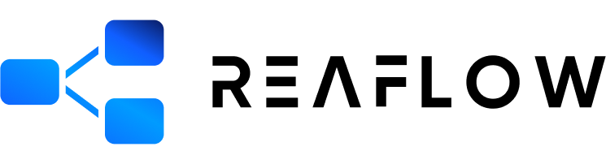

<div align="center">
  
  <br />
  Node-based Visualizations for React
  <br /><br />
  <a href="https://github.com/reaviz/reaflow/workflows/build/">
    
  </a>
  <a href="https://npm.im/reaflow">
    
  </a>
  <a href="https://npm.im/reaflow">
    
  </a>
  <a href="https://github.com/reaviz/reaflow/blob/master/LICENSE">
    
  </a>
  <a href="https://bundlephobia.com/result?p=reaflow">
    
  </a>
  <a href="https://discord.gg/tt8wGExq35">
    
  </a>
  <a href="https://opencollective.com/reaviz">
    
  </a>
</div>

---

REAFLOW is a modular diagram engine for building static or interactive editors. The library is feature-rich and modular allowing for displaying complex
visualizations with total customizability.

Checkout Unify Viz, our premium offering 300+ Figma and React professionally designed data visualization components. [Learn more →](https://unifyviz.com?utm=reaflow)

If you are looking for network graphs, checkout [reagraph](https://reagraph.dev).

## 🚀 Quick Links

- Checkout the [**docs and demos**](https://reaflow.dev)
- Learn about updates from the [Changelog](CHANGELOG.md)

## 💎 Other Projects

- [Unify Viz](https://unifyviz.com) - Premium offering 300+ Figma and React professionally designed data visualization
components.
- [Reagraph](https://reagraph.dev) - Open-source library for large webgl based network graphs.
- [Reablocks](https://reablocks.dev) - Open-source component library for React based on Tailwind.
- [Reaviz](https://reaviz.io) - Open-source library for data visulizations for React. 

## ✨ Features

- Complex automatic layout leveraging ELKJS
- Easy Node/Edge/Port customizations
- Zooming / Panning / Centering controls
- Drag and drop Node/Port connecting and rearranging
- Nesting of Nodes/Edges
- Proximity based Node linking helper
- Node/Edge selection helper
- Undo/Redo helper

## 📦 Usage

Install the package via **NPM**:

```
npm i reaflow --save
```

Install the package via **Yarn**:

```
yarn add reaflow
```

Import the component into your app and add some nodes and edges:

```jsx
import React from 'react';
import { Canvas } from 'reaflow';

export default () => (
  <Canvas
    maxWidth={800}
    maxHeight={600}
    nodes={[
      {
        id: '1',
        text: '1'
      },
      {
        id: '2',
        text: '2'
      }
    ]}
    edges={[
      {
        id: '1-2',
        from: '1',
        to: '2'
      }
    ]}
  />
);
```

## 🔭 Development

If you want to run reaflow locally, its super easy!

- Clone the repo
- `npm i`
- `npm start`
- Browser opens to Storybook page

## ❤️ Contributors

Thanks to all our contributors!

<a href="https://github.com/reaviz/reaviz/graphs/contributors"></a>
